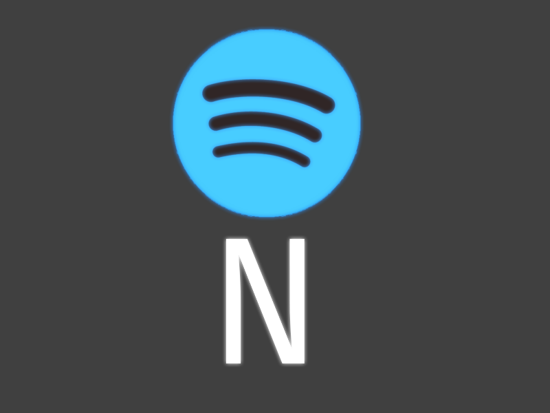

# NFy Music service

NFy is PC Spotify/Music listening alternative which provides simplistic features, extendablility, and a nice, easy to read code-base.

Along with a code-base, it also comes with a song server. Which you can find at https://thekaigonzalez.github.io/NFy

## Why use NFy?

### Open Source

NFy is open source, being actively worked on, with new songs every day!

You can submit songs via Pull requests, and also Edit NFy's source code :)

### Less RAM Usage

Tests show that there is a 20+ MB ram difference between NFy and Spotify, including [Ads](#no-ads) and [Network](#no-external-service) usages.

### No Ads

NFy uses no ads, therefore no [Net](#no-external-service) buffering. Therefore you can listen to music without interruptions.

### No External Service

No external internet services are used unlike spotify, while this does limit the features of NFy, it does allow you to listen to music handsfree.

*the Modified Spotify logo originates from Spotify, all terms under Spotify Technology S.A, and they're respectful owner.*